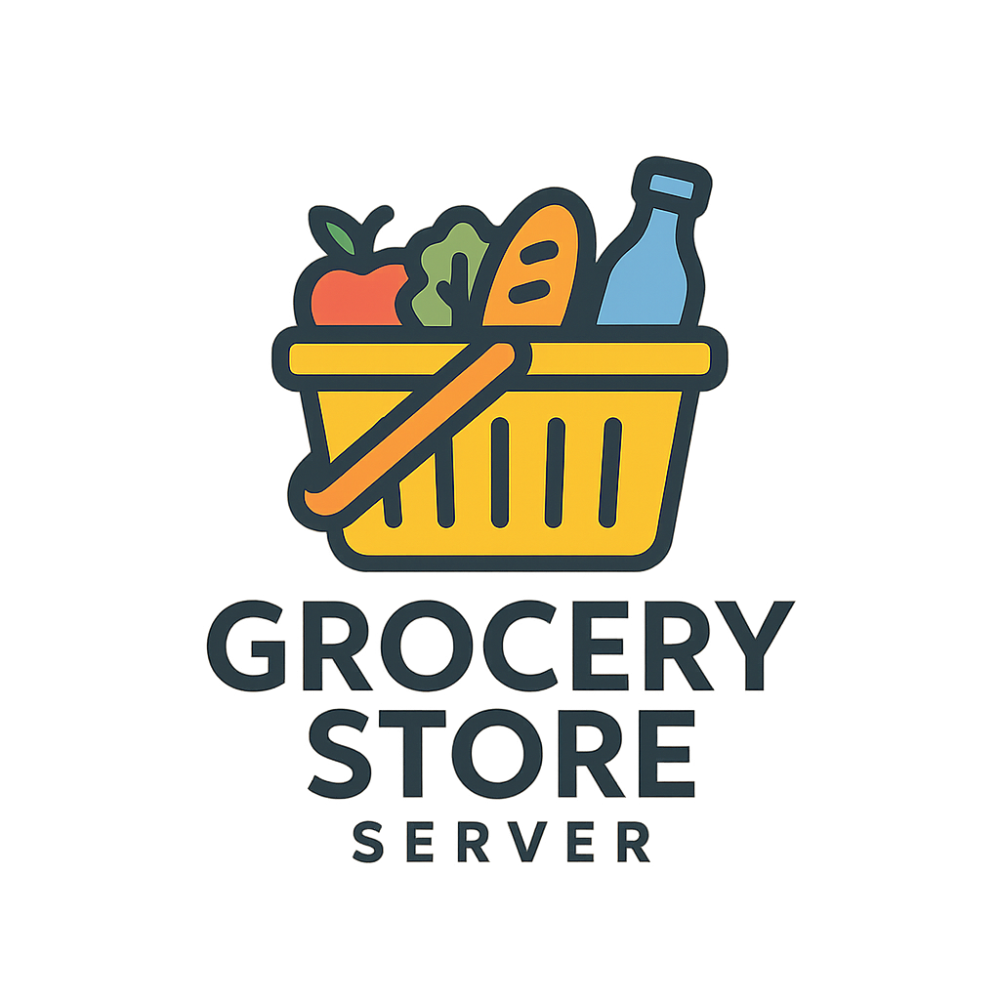
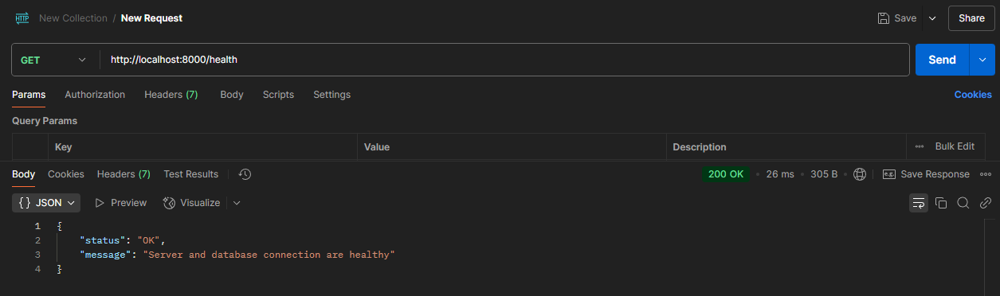

<!-- PROJECT SHIELDS -->
[![Forks][forks-shield]][forks-url]
[![Stargazers][stars-shield]][stars-url]
[![Issues-open][issues-open-shield]][issues-url]
[![Issues-closed][issues-closed-shield]][issues-url]
[![Contributors][contributors-shield]][contributors-url]
[![Framework][badge-framework]][framework-url]
[![contributions welcome][contributions-welcome]][issues-url]

<!-- PROJECT LOGO -->
<br />
<p align="center">
  <a href="https://github.com/Israel-Laguan/grocery-store-server">
	  
  </a>

  <h1 align="center">
	Grocery Store Server
  </h1>

  <p align="center">
    Backend for managing grocery store operations
    <br />
	  🖊️
    <a href="https://github.com/Israel-Laguan/grocery-store-server">Explore the docs</a>
    🐞
    <a href="https://github.com/Israel-Laguan/grocery-store-server/issues">Report a Bug</a>
    🙋‍♂️
    <a href="https://github.com/Israel-Laguan/grocery-store-server/issues">Request Feature</a>
  </p>
</p>

## Table of Contents

1. [The Project](#the-project)
2. [Features](#features)
3. [Prerequisites](#prerequisites)
4. [Getting Started](#getting-started)
5. [Author](#author)
6. [Contributing](#contributing)
7. [Show your support](#show-your-support)
8. [License](#license)

# The Project

The Grocery Store Server project provides a backend service for managing grocery store operations, such as inventory management, order processing, and customer data.

# Features

- 🛒 Manage inventory items and stock levels  
- 📦 Process customer orders and track order history  
- 🔐 Authentication and user roles (admin, customer)  
- 📊 Order summaries and historical views  

# Prerequisites

Before running the project, ensure you have the following installed on your machine:

- 🟢 Node.js (v14 or higher)
- 📦 npm (Node Package Manager)
- 🗃️ PostgreSql (or any configured database)
- 🐳 Docker

# Getting Started

To get a local copy up and running, follow these simple steps:

1. **Clone the repository**
   ```bash
   git clone https://github.com/Israel-Laguan/grocery-store-server.git
   ```

2. **Install dependencies**
   ```bash
   npm install
   ```

3. **Create the container and star the server**
    ```bash
    docker-compose up
    ```

The server will start on http://localhost:8000 

You can use http://localhost:8000/health to check the connection status.
<p align="center">  </p>

# Author

<table style="width:100%"> <tr> <td> <div align="center"> <a href="./docs/img/photo.png" target="_blank" rel="author">  </a> <h2> <a href="https://israel-laguan.github.io/" target="_blank" rel="author"> Israel Laguan </a> </h2> </div> </td> <td> <div align="center"> <a href="mailto:israellaguan@gmail.com" target="_blank" rel="author">  <h3> Email me to <a href="mailto:israellaguan@gmail.com"> israellaguan@gmail.com </a> </h3> </a> <a href="https://www.linkedin.com/in/israellaguan/" target="_blank" rel="author">  <h3> Connect to my Linkedin </h3> </a> <a href="https://github.com/Israel-Laguan" target="_blank" rel="author">  <h3> Check my GitHub Profile </h3> </a> </div> </td> </tr> </table>


# Contributing

[![contributions welcome][contributions-welcome]][issues-url]


 Contributions, issues and feature requests are welcome! Feel free to check the <a href="https://github.com/Israel-Laguan/grocery-store-server/blob/main/CONTRIBUTING.md">Issues pages</a> 

# Show your support

🤗 Give a ⭐️ if you like this project!


# License

[![License][badge-license]](http://badges.mit-license.org)

📝 This project is licensed under the [MIT](LICENSE)\
Feel free to fork this project and improve it

<!-- MARKDOWN LINKS & IMAGES -->
[contributors-shield]: https://img.shields.io/github/contributors/Israel-Laguan/grocery-store-server?style=for-the-badge
[contributors-url]: https://github.com/Israel-Laguan/grocery-store-server/graphs/contributors
[forks-shield]: https://img.shields.io/github/forks/Israel-Laguan/grocery-store-server?style=for-the-badge
[forks-url]: https://github.com/Israel-Laguan/grocery-store-server/network/members
[stars-shield]: https://img.shields.io/github/stars/Israel-Laguan/grocery-store-server?style=for-the-badge
[stars-url]: https://github.com/Israel-Laguan/<repo>/stargazers
[issues-open-shield]: https://img.shields.io/github/issues/Israel-Laguan/grocery-store-server?style=for-the-badge
[issues-url]: https://github.com/Israel-Laguan/grocery-store-server/issues
[issues-closed-shield]: https://img.shields.io/github/issues-closed/Israel-Laguan/grocery-store-server?style=for-the-badge
[badge-framework]: https://img.shields.io/badge/framework-here-9cf?style=for-the-badge
[framework-url]: https://google.com
[contributions-welcome]: https://img.shields.io/badge/contributions-welcome-brightgreen.svg?style=for-the-badge
[badge-license]: https://img.shields.io/:license-mit-blue.svg?style=for-the-badge